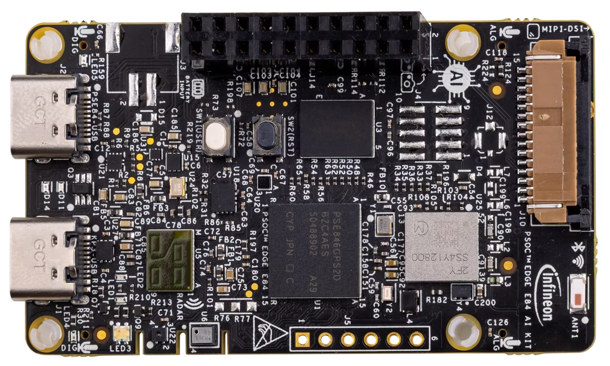

.. _psoc_edge_quickref:

.. include:: links.rst

Quick reference for the PSOC™ Edge
===================================

The `PSOC™ Edge E84 AI Kit <https://www.infineon.com/evaluation-board/KIT-PSE84-AI>`_.

Below is a quick reference for PSOC™ Edge E84 boards. If it is your first time
working with this port it may be useful to get an overview of the microcontroller:

.. toctree::
   :maxdepth: 1
   :includehidden:

   general.rst
   installation.rst

Pins and GPIO
-------------

See :ref:`machine.Pin <machine.Pin>` for the complete Pin API reference.
This section focuses on the specific PSOC™ Edge port variations and particularities.

The constructor
^^^^^^^^^^^^^^^

The controller pin naming follows the nomenclature ``P<port>_<pin>``, where:

 - ``<port>`` is a numeric identifier for the port (e.g., 0-21 for the PSOC™ Edge E84)
 - ``<pin>`` is the pin number within that port.

Use the respective board pinout diagram to find the available pins and their locations.

This is the ``id`` that needs to be passed to the constructor in one of the following formats:

 - As a **string label**, single or double quoted: ``'P<port>_<pin>'`` or ``"P<port>_<pin>"``
 - A **pre-instantiated object** ``Pin.cpu.<pin>`` or ``Pin.board.<pin>``.

::

    from machine import Pin

    p_in  = Pin('P0_0', Pin.IN)
    p_out = Pin("P7_0", Pin.OUT, value=False)

    p = Pin(Pin.cpu.P17_1, Pin.OPEN_DRAIN)

The pre-instantiated object can be used directly without calling the constructor.
Instead, you can use ``init()`` to configure it.

::

    from machine import Pin

    pin = Pin.cpu.P17_0
    pin.init(mode=Pin.IN)

.. tip::
    Use the REPL interface to discover the available user pins, using tab for completion:

    >>> from machine import Pin
    >>> Pin.cpu.P
    P10_5           P10_7           P11_3           P12_3
    P13_0           P13_1           P13_2           P13_3
    P13_4           P13_5           P13_6           P13_7
    P14_0           P14_1           P14_2           P14_3
    P14_4           P14_5           P14_6           P14_7
    P15_0           P15_1           P15_2           P15_3
    P15_4           P15_5           P15_6           P15_7
    P16_0           P16_1           P16_2           P16_3
    P16_4           P16_5           P16_6           P16_7
    P17_0           P17_1           P17_2           P17_3
    P17_4           P17_5           P17_7           P20_3
    P20_4           P20_5           P20_6           P20_7
    P21_1           P21_2           P21_3           P21_4
    P21_5           P21_6           P21_7           P3_0
    P3_1            P6_4            P6_6            P7_0
    P7_7            P8_0            P8_1            P8_5
    P8_6            P9_0            P9_1            P9_2
    P9_3

    .. Add Pin.board.xxx when we define some pins. This will be more helpful.

.. warning::
    Currently no ``Pin.board.<pin>`` are defined for the PSOC™ Edge E84 AI Kit.

In addition to the supported ``pull`` configuration values, ``PULL_UP_DOWN`` is also available in this port.

The ``drive`` parameter accepts up to 8 levels, which set the following drive strength for the pin:

 - ``DRIVE_0``: 1mA/2mA drive current (normal/high speed IO)
 - ``DRIVE_1``: 2mA/4mA drive current (normal/high speed IO)
 - ``DRIVE_2``: 3mA/6mA drive current (normal/high speed IO)
 - ``DRIVE_3``: 4mA/8mA drive current (normal/high speed IO)
 - ``DRIVE_4``: 5mA/10mA drive current (normal/high speed IO)
 - ``DRIVE_5``: 6mA/12mA drive current (normal/high speed IO)
 - ``DRIVE_6``: 7mA/14mA drive current (normal/high speed IO)
 - ``DRIVE_7``: 8mA/16mA drive current (normal/high speed IO)

For more information about drive strength, check the PSOC™ Edge `Datasheet <pse8x_consumer_datasheet_>`_ and `Architecture Reference Manual <pse8x_arch_ref_manual_>`_.

.. note::

    The following constructor arguments and/or configuration values are NOT supported in this port:

        - ``alt``: Alternate functionality is not supported.
        - ``mode``: ``Pin.ALT``, ``Pin.ALT_OPEN_DRAIN``, and ``Pin.ANALOG`` modes are not supported.

Methods
^^^^^^^

.. method:: Pin.irq(handler=None, trigger=(Pin.IRQ_FALLING | Pin.IRQ_RISING), priority=7)

The following parameters have port-specific behavior:

    - ``priority``: Priority values range from 7 (lowest) to 0 (highest). Default is 7.

      .. note::

          All pins on the same port share the same interrupt line. Therefore, only one priority can be set for all pins on the same port. 
          If multiple pins configure interrupts for the same port, the highest priority will be used.
          If only one pin is configured for an interrupt, its priority can be reconfigured to any value.

.. note::

    The following ``irq()`` features are not supported in this port:

        - ``trigger``: The ``Pin.IRQ_LOW_LEVEL`` and ``Pin.IRQ_HIGH_LEVEL`` triggers are not supported.
        - ``wake``: The wake parameter is currently not supported.
        - ``hard``: This parameter is ignored. It can be passed but currently has no effect.

.. note::

    **None** of the non-core methods from the Pin API are currently implemented for this port.

Hardware I2C bus
----------------

See :ref:`machine.I2C <machine.I2C>` and :ref:`machine.I2CTarget <machine.I2CTarget>` for the complete I2C API reference.

Hardware I2C is available on the PSOC™ Edge E84 using the SCB (Serial Communication Block) 
peripheral. The port supports both controller (master) and target (slave) modes.

.. note::

    External pull-up resistors (typically 4.7kΩ) are required on both SCL and SDA lines.
    Only one I2C instance (controller or target) can be active at a time, as both modes 
    share the same SCB peripheral and pins.

.. warning::

    The KIT_PSE84_AI board has only one hardware I2C peripheral with fixed pins:
    P17_0 (SCL) and P17_1 (SDA). These pins cannot be changed. If you specify 
    custom pins in the constructor, they will be ignored and a warning message 
    will be printed.

Controller mode (Master)
^^^^^^^^^^^^^^^^^^^^^^^^

Use the ``I2C`` class for controller (master) operations::

    from machine import I2C

    # Create I2C - uses fixed pins P17_0 (SCL) and P17_1 (SDA)
    i2c = I2C(freq=400000)
    
    # Pin parameters are optional but ignored on KIT_PSE84_AI
    i2c = I2C(scl='P17_0', sda='P17_1', freq=100000)  # Prints warning, uses P17_0/P17_1

Constructor arguments:

    - ``id``: I2C bus number (currently only 0 is available). This parameter is ignored.
    - ``freq``: I2C clock frequency in Hz. Supported: 100000 (100kHz) or 400000 (400kHz). 
      Default is 400000.
    - ``scl``: SCL pin (string 'P<port>_<pin>' or Pin object). **Ignored on KIT_PSE84_AI** 
      - always uses P17_0. Prints warning if specified.
    - ``sda``: SDA pin (string 'P<port>_<pin>' or Pin object). **Ignored on KIT_PSE84_AI** 
      - always uses P17_1. Prints warning if specified.

Standard I2C controller methods are supported:

    - ``scan()``: Scan for I2C devices on the bus.
    - ``readfrom(addr, nbytes)``: Read from a device.
    - ``readfrom_into(addr, buf)``: Read into an existing buffer.
    - ``writeto(addr, buf)``: Write data to a device.
    - ``readfrom_mem(addr, memaddr, nbytes)``: Read from device memory.
    - ``writeto_mem(addr, memaddr, buf)``: Write to device memory.

Target mode (Slave)
^^^^^^^^^^^^^^^^^^^

The I2CTarget implementation on PSoC Edge has the following port-specific details:

**Fixed pins (KIT_PSE84_AI):**
    - SCL: P17_0
    - SDA: P17_1
    - Custom pin parameters are ignored with a warning message

**Memory addressing:**
    - ``mem_addrsize``: Only 0 is supported (no memory addressing)
    - EEPROM-like addressing (8/16/24/32 bit) is not yet implemented

**IRQ events** - All standard events are supported:
    - ``IRQ_ADDR_MATCH_READ``, ``IRQ_ADDR_MATCH_WRITE``
    - ``IRQ_READ_REQ``, ``IRQ_WRITE_REQ``
    - ``IRQ_END_READ``, ``IRQ_END_WRITE``

